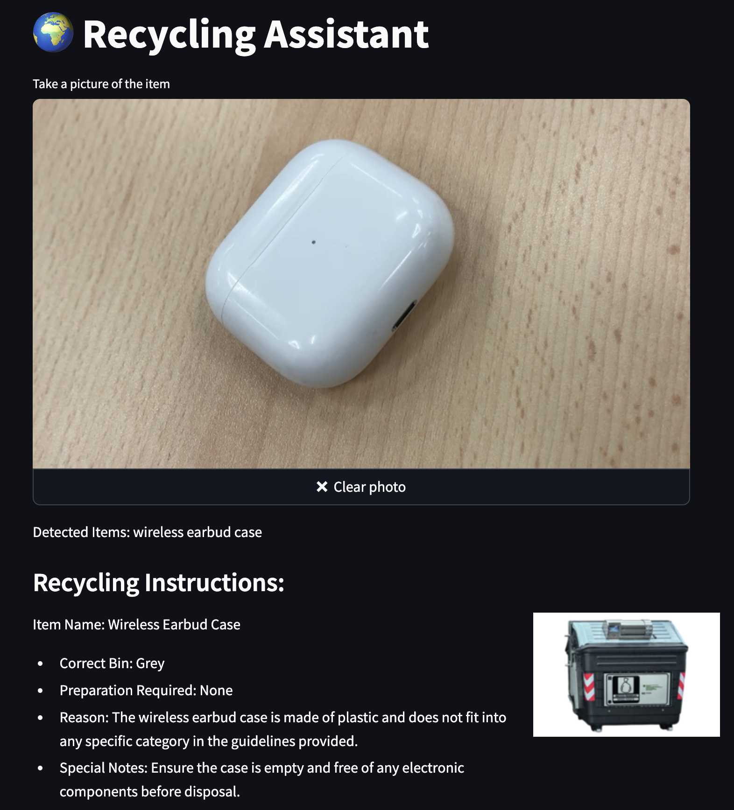

#  🌍 Traish (Recycling Assistant)
A smart web application that helps users properly sort and recycle items using computer vision and AI. The application provides detailed recycling instructions based on image analysis and local recycling guidelines, powered by **LLaMA**'s context-aware capabilities.
    

## Demo

https://alessiochen-traish-app-ilje0r.streamlit.app/

## Features

- 📸 Image-based item recognition
- 🗑️ Detailed sorting instructions for each identified item
- 🎯 Bin color coding system
- 🔍 Nearby ecological sites finder
- 🤖 AI-powered waste classification
- 📋 Structured recycling guidelines
- 🧠 Context-aware recycling rules powered by LLaMA

## How It Works
The application leverages LLaMA's powerful context understanding to:

- Process local recycling guidelines and regulations
- Match identified items with the correct disposal methods
- Provide accurate sorting instructions based on item characteristics
- Explain the reasoning behind each recycling decision
- Adapt recommendations to local waste management rules
## Technologies Used

## Data Source
The recycling guidelines and bin classification system are based on the official document from [Rome's municipality](https://www.comune.roma.it/web-resources/cms/documents/Istruzioni_Uso_famiglie_Nuovi_Colori_Cassonetti.pdf)


- **Frontend**: Streamlit
- **AI Services**:
- Groq and llama for recycling instructions
- Toolhouse for location-based services

## Prerequisites

- Python 3.8+
- Required API keys:
- OpenAI API key
- Groq API key
- Toolhouse API key

## Installation

1. Clone the repository and install the dependencies:

```
cd traish 
pip install -r requirements.txt

```

2. Set up your environment variables in `.streamlit/secrets.toml`:

```
[api_keys]
groq = "your_groq_api_key"
openai = "your_openai_api_key"
toolhouse = "your_toolhouse_api_key"
```

## Usage 
1. Start the application:
```
streamlit run app.py
```
